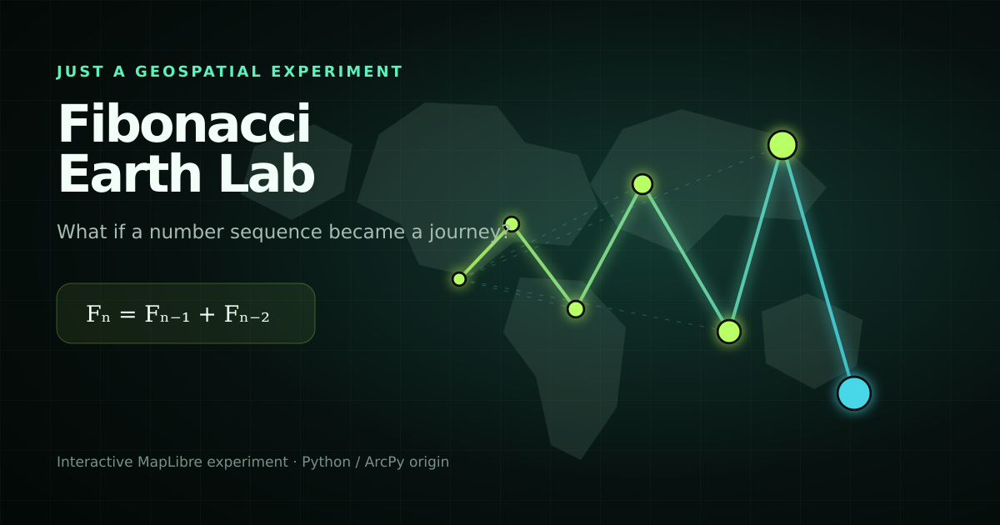

# Fibonacci Earth Lab



**What happens when a number sequence becomes geography?**

Fibonacci Earth Lab is a small interactive geospatial experiment. Starting at **Ciudad Mitad del Mundo, Ecuador**, each Fibonacci number becomes a point on Earth. The app compares the original 45° rotation with the **golden angle (137.5°)** and makes the resulting spatial pattern visible in real time.

## Interactive features

- Animated Fibonacci sequence on a MapLibre map
- Select any location on Earth as the origin, with Mitad del Mundo as the default
- Golden-angle and original 45° pattern comparison
- Adjustable sequence length and geographic reach
- Places panel with country/territory intersection and the nearest mapped city for every term
- Latitude and longitude (WGS84 decimal degrees) in every result and map popup
- Click a place, sequence term or map point to focus and highlight it
- Hover details for term, place, coordinates, distance and bearing
- Shareable URL state
- One-click GeoJSON export
- Clean recording mode — press `H` to hide the interface
- Responsive layout for desktop and mobile

## Run locally

The web experiment is static and has no build step.

```bash
python -m http.server 8000
```

Open `http://localhost:8000`.

## Spatial analysis

Open **Places** to browse every term, including the two separate terms with value 1. Results update when the origin, rotation, reach or sequence length changes. Each row reports the country polygon containing the point and the closest city in the bundled Natural Earth dataset, with great-circle distance in kilometres. On small screens, selecting a result reveals the map; **Controls** returns to the settings.

The analysis uses two bundled [Natural Earth datasets](assets/GEOGRAPHY.md): 242 country and territory polygons at **1:50m** and 7,342 populated places at the more detailed **1:10m** scale. It needs no API key and makes no external reverse-geocoding calls. It analyzes term points, not the lines connecting them. Country and coastline boundaries are approximate; the nearest mapped city is a reference location, not an exact address or a claim that the point lies in that city. Unmatched points display **Open water / unmapped land**.

GeoJSON exports include `lat`, `lon`, `analysisStatus`, `country`, `countryCode`, `nearestPlace`, `nearestPlaceCountry` and `nearestPlaceDistanceKm` when geography is ready. Geometry keeps standard GeoJSON `[longitude, latitude]` order. If geography cannot load, coordinates and map controls remain available, the panel offers a retry, and the export records the analysis status instead of inventing place names.

Run the geographic checks with `node --test tests/geo-analysis.test.mjs`.


## How the geography is generated

1. Generate the Fibonacci sequence `1, 1, 2, 3, 5, 8…`.
2. Normalize each value to the selected maximum geographic reach.
3. Use the sequence value for radial distance and the selected rotation rule for bearing.
4. Calculate every location as a geodesic destination from the selected origin.
5. Render the points, radial guides and connecting path as GeoJSON.

The radius uses `sqrt(Fn / Fmax) × maximum reach`. The square root keeps early terms readable while preserving their nonlinear growth.

## Original ArcPy experiment

The project began as [`fibonacii.py`](fibonacii.py), a Python/ArcPy script that writes Fibonacci points to an ArcGIS geodatabase in EPSG:3857. The browser version keeps that GIS idea, adds geodesic calculations and turns it into a shareable interactive story.

## Technology

- JavaScript
- MapLibre GL JS
- GeoJSON
- Python / ArcPy (original experiment)

Built just for fun — where mathematics meets maps.
